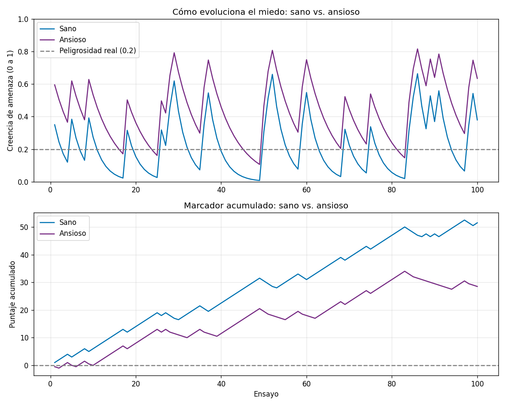

# Agente ansioso 🧠

Simulación en Python de un mecanismo de aprendizaje de **amenaza/seguridad** que
compara un agente **"sano"** con uno **"ansioso"**, inspirada en modelos de
psiquiatría computacional (aprendizaje por refuerzo y modelos bayesianos de la
ansiedad, en la línea de **Dayan, Montague y Friston**).

Los dos agentes usan **exactamente el mismo código**. Lo único que cambia son los
**valores de sus parámetros**. Aun así, uno aprende a ver el mundo con claridad y
prospera, mientras el otro vive con más miedo del necesario y paga por ello.

## La idea

En cada uno de 100 ensayos, el agente enfrenta una situación incierta (un "cuarto"
que en realidad es peligroso el 20% de las veces) y hace tres cosas:

1. **Decide** si explorar (acercarse) o evitar (alejarse), comparando el *valor
   esperado* de cada opción.
2. **Observa** lo que ocurrió: peligro (1) o seguro (0).
3. **Aprende**, ajustando su creencia de amenaza con la regla de error de
   predicción (**Rescorla–Wagner**):

   ```
   creencia_nueva = creencia_vieja + tasa_de_aprendizaje × (observación − creencia_vieja)
   ```

La clave de la ansiedad está en usar **tasas de aprendizaje asimétricas**: el agente
ansioso aprende el peligro rápido pero la seguridad muy lento, así que el miedo
"se le pega" aunque el mundo le muestre calma una y otra vez.

## Los parámetros

| Parámetro | Sano | Ansioso | Qué controla |
|---|---|---|---|
| `creencia_inicial_amenaza` | 0.5 | 0.7 | Miedo con el que arranca, antes de tener evidencia. |
| `tasa_aprendizaje_amenaza` | 0.3 | 0.4 | Qué tan rápido aprende que algo es peligroso. |
| `tasa_aprendizaje_seguridad` | 0.3 | 0.15 | Qué tan rápido aprende que algo es seguro. |
| `tolerancia_a_incertidumbre` | 0.5 | 0.25 | Qué tanto peligro tolera antes de volverse pesimista. |
| `costo_de_evitacion` | 0.5 | 0.5 | Cuánta recompensa pierde cada vez que evita (igual para ambos, para una comparación justa). |

## Resultado



- **Arriba (el miedo):** la línea morada (ansioso) va **siempre por encima** de la
  azul (sano), y sus valles **nunca tocan el piso** — la evidencia de seguridad casi
  no le entra. El sano, en cambio, baila alrededor de la peligrosidad real (0.2).
- **Abajo (el marcador):** ambos ganan puntos, pero la **brecha se ensancha**. Esa
  distancia creciente entre las dos líneas es el **costo de la ansiedad**.

| | Marcador final | Veces que evitó |
|---|---|---|
| 🔵 Sano | +51.5 | 3 de 100 |
| 🟣 Ansioso | +28.5 | 29 de 100 |

La moraleja: la ansiedad, en este modelo, **no es un cerebro roto**. Es un sistema de
aprendizaje perfectamente lógico, con las perillas en otra posición.

## Cómo correrlo

Requiere Python con `numpy` y `matplotlib`.

```bash
# crear el entorno virtual e instalar dependencias
python -m venv venv
source venv/bin/activate
pip install numpy matplotlib

# correr la simulación (imprime los resultados y genera comparacion.png)
python agente.py
```

## Inspiración

- **Peter Dayan** — aprendizaje por refuerzo y la dopamina como señal de error de predicción.
- **P. Read Montague** — codificación neural de la recompensa y la sorpresa.
- **Karl Friston** — inferencia activa y el "cerebro bayesiano".
